<h1 align="center">Hi 👋, I'm bhwa233</h1>

  
  

  
  

### 🌐 My Sites
- 📸 [Image Hosting](https://telegraph-image-bww.pages.dev)
- 🎵 [Social Media Downloader](https://downloader.bhwa233.com) 
- 📈 [Chinese Stock Daily](https://stock.bhwa233.com) 
- 🏠 [Personal Blog (Current)](https://notion-next-plum-chi.vercel.app/) 
- 🏠 [Previous Blog](https://lxw15337674.github.io) 

### 📊 GitHub Stats

  

### 🛠️ Languages and Tools

  
  
  
  
  

---

💡 <i>Let's connect and build something amazing together!</i>

